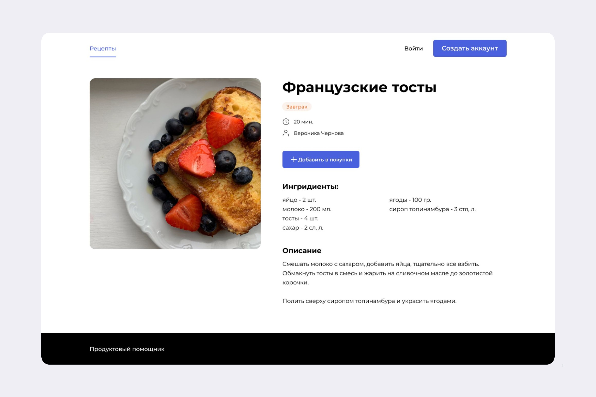

# Foodgram

## Описание проекта
Foodgram — сайт, на котором пользователи могут публиковать рецепты, добавлять чужие рецепты в избранное и подписываться на публикации других авторов. Пользователям сайта также доступен сервис «Список покупок». Он позволяет создавать список продуктов, которые нужно купить для приготовления выбранных блюд.

## Возможности
В проекте реализовано:
- Фронтенд на React, бэкенд на Django 3.2.3
- Система регистрации и аутентификации пользователей

## Инструкция по запуску

**Необходимая версия Python 3.9.13**

Проект разворачивается на сервере используя технологию контейнеризации Docker.
Для успешного прохождения тестов, автоматического разворачивания проекта на сервере и отправки оповещения в телеграм
необходимо в git репозитории во вкладке settings перейти в "Secrets and variables" и нажать Actions.
Здесь необходимо задать следующие переменные:
- DOCKER_PASSWORD
- DOCKER_USERNAME
- HOST
- SSH_KEY
- SSH_PASSPHRASE
- TELEGRAM_TO
- TELEGRAM_TOKEN
- USER

Создайте на сервере директорию foodgram.
Также для обеспечения безопасности необходимо создать файл .env (по образцу .env.example) и скопировать его в директорию проекта на сервере.

После внесения всех настроек проект автоматически будет проверяться на ошибки по flake8 и разворачиваться на сервере при каждом пуше в ветку master.
Настройте свой nginx сервер для перенаправления запросов на нужный адрес проекта. 

## Использованные технологии
- Python
- Django
- Django REST Framework
- Postgres
- Docker
- Djoser
- CI/CD

## Об авторе
Автор - студент Яндекс.Практикум 25 когорты Константин Упоров. Python backend-разработчик.
email для связи - <orbikadm@gmail.com>
